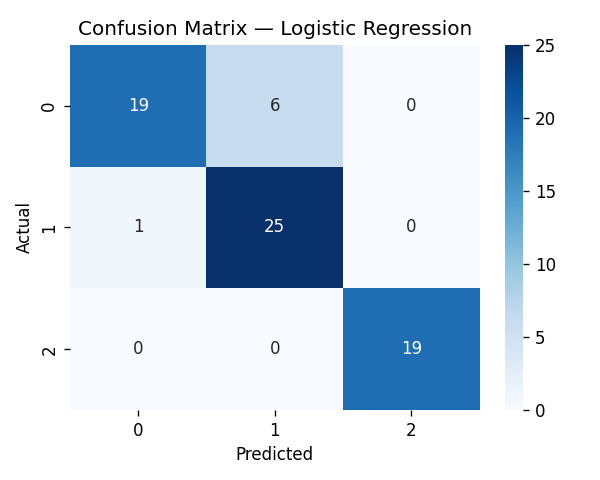
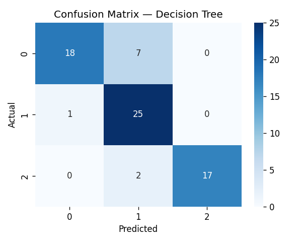

# 📊 E-commerce Customer Satisfaction Predictor

A machine learning-based end-to-end classification system that predicts customer satisfaction levels (Neutral, Satisfied, Unsatisfied) based on their interaction data. The project implements a complete pipeline starting from raw data ingestion and preprocessing, model training and comparison of **Logistic Regression** and **Decision Tree Classifier**, to final deployment as an interactive **Streamlit** web application.

---

## Overview

This repository packages a complete small-scale machine learning workflow around customer satisfaction prediction. It automates:
* Data preparation (cleaning, missing values imputation, encoding, multicollinearity check, feature selection).
* Model training, comparison, and evaluation for two classifers.
* UI-based interactive interface for prediction.

In practical terms, it solves a narrow business question: given customer purchase signals, can the system estimate the customer's satisfaction category without retraining a model every time?

---

## Key Features

- **Data Ingestion & Cleaning**: Automatic handling of missing values (numeric filled with median, categoricals with mode) and label encoding.
- **Feature Selection**: Drops identifier columns (`Customer ID`) and resolves multi-collinearity by dropping highly correlated columns ($|r| > 0.9$). Automatically selects top features based on their correlation with the target variable (`Satisfaction Level`).
- **Dual Model Pipeline**: Trains and compares a scaled **Logistic Regression** model and an unscaled **Decision Tree Classifier**.
- **Model Evaluation**: Generates metrics (accuracy, precision, recall, F1-score) and visualizes results by saving confusion matrix heatmaps (`cm_logistic_regression.png` and `cm_decision_tree.png`).
- **Interactive UI**: A Streamlit web dashboard enabling users to input customer parameters (Discount Applied, Days Since Last Purchase) and get real-time predictions, confidence scores, and probability breakdowns from both models.
- **Model Serialization**: Saves models, scalers, and feature list using `pickle` for offline and fast loading.

---

## Tech Stack

| Layer | Technology | Purpose |
| ----- | ---------- | ------- |
| **Language** | Python | Main runtime for data preprocessing, model training, and Streamlit backend |
| **User Interface** | Streamlit | Lightweight web app framework to build and run the prediction UI |
| **Data Manipulation** | Pandas & NumPy | Handing tabular operations, CSV ingestion, and missing value checks |
| **Machine Learning** | Scikit-Learn | Implements preprocessing (`StandardScaler`, `LabelEncoder`), modeling (`LogisticRegression`, `DecisionTreeClassifier`), and metrics |
| **Visualization** | Matplotlib & Seaborn | Generate confusion matrix heatmaps for model evaluation |
| **Serialization** | Pickle | Dumping and loading machine learning models and pipelines |

---

## Screenshots (Optional)

The pipeline automatically generates confusion matrices during model training and evaluation:

* **Logistic Regression Confusion Matrix**
  
  
* **Decision Tree Confusion Matrix**
  

---

## Project Structure

```text
ecommerce-customer-satisfaction/
├── app.py                     # Streamlit frontend & interactive prediction UI
├── preprocess.py              # Data preprocessing, encoding & feature selection
├── train.py                   # Model training, evaluation & serialization
├── dataset_raw.csv            # Raw dataset used for training/evaluation
├── lr_model.pkl               # Serialized Logistic Regression model
├── dt_model.pkl               # Serialized Decision Tree model
├── scaler.pkl                 # Serialized StandardScaler for Logistic Regression input
├── features.pkl               # Serialized list of selected features
├── cm_logistic_regression.png # Confusion matrix plot for Logistic Regression
├── cm_decision_tree.png       # Confusion matrix plot for Decision Tree
└── README.md                  # Project documentation
```

---

## Getting Started

### Prerequisites

Before setting up the project, make sure you have the following installed:
* Python 3.8 or higher
* `pip` (Python Package Installer)

### Installation

1. Clone the repository:
   ```bash
   git clone https://github.com/harshitsinghal11/ecommerce-customer-satisfaction.git
   cd ecommerce-customer-satisfaction
   ```

2. Create a virtual environment:
   ```bash
   # On Windows (PowerShell)
   python -m venv .venv
   .venv\Scripts\Activate.ps1

   # On macOS/Linux
   python -m venv .venv
   source .venv/bin/activate
   ```

3. Install the required dependencies:
   ```bash
   pip install numpy pandas scikit-learn matplotlib seaborn streamlit
   ```

### Environment Variables

No environment variables are required for this project. The application loads models and configurations directly from the local directory structure.

### Running Locally

1. **Train the models (Generate artifacts)**:
   Run the training script to process the raw dataset, train the models, save evaluation plots, and dump pickle artifacts:
   ```bash
   python train.py
   ```
   
2. **Start the Streamlit application**:
   Launch the web dashboard to perform real-time predictions:
   ```bash
   streamlit run app.py
   ```
   
3. **Open the browser**:
   Navigate to the local URL (usually `http://localhost:8501`) shown in your terminal.

---

## Available Scripts

* **`preprocess.py`**: Can be run independently to sanity-check data processing:
  ```bash
  python preprocess.py
  ```
* **`train.py`**: Executes the training workflow and visualizes performance:
  ```bash
  python train.py
  ```
* **`app.py`**: Runs the interactive app using streamlit:
  ```bash
  streamlit run app.py
  ```

---

## Deployment

To deploy this project to the cloud:
1. **Streamlit Community Cloud**:
   * Push your code to a public GitHub repository.
   * Go to [share.streamlit.io](https://share.streamlit.io/) and connect your repository.
   * Set the main file path to `app.py` and deploy!
2. **Docker**:
   * Create a `Dockerfile` using a standard `python:3.10-slim` image.
   * Install requirements, expose port `8501`, and run `streamlit run app.py --server.port 8501 --server.address 0.0.0.0`.

---

## Project Status

**Completed** - The project features a fully operational preprocessing, training, evaluation, and serving pipeline.

---

## Contributing

1. Fork the project.
2. Create a feature branch: `git checkout -b feature/AmazingFeature`
3. Commit your changes: `git commit -m 'Add some AmazingFeature'`
4. Push to the branch: `git push origin feature/AmazingFeature`
5. Open a Pull Request.

---

## License

This project is open-source. Currently, no explicit license is specified.

---

## Contact

Built by **Harshit** — B.Tech CSE, Manav Rachna University

- [GitHub](https://github.com/harshitsinghal11)
- [LinkedIn](https://linkedin.com/in/harshitsinghal11)

> _Feel free to reach out if you're building something similar or have questions about the implementation._
